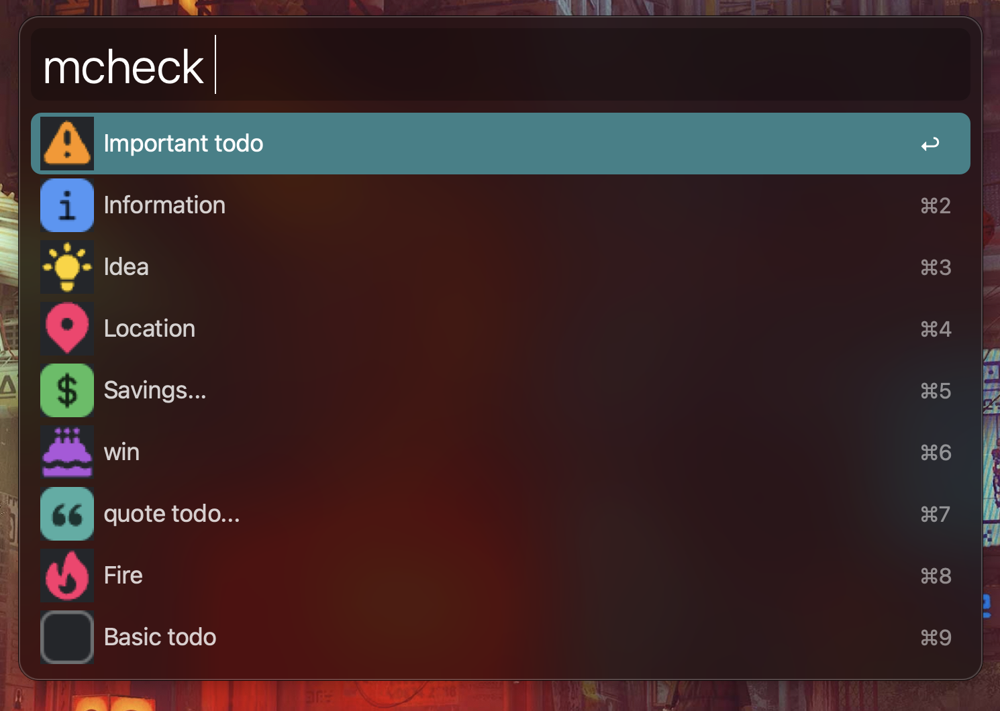

# Obsidian Minimal theme checklist icons Alfred workflow

Alfred workflow for inserting [Obsidian Minimal theme checklist icons](https://minimal.guide/Block+types/Checklists) from a searchable filter:

## Usage

Invoke with the keyword `mcheck`, and either start searching by typing the name of the checklist icon, or just scroll through the list.

* Copy without pasting: `enter`
* Copy and paste into frontmost app: `command + enter`

